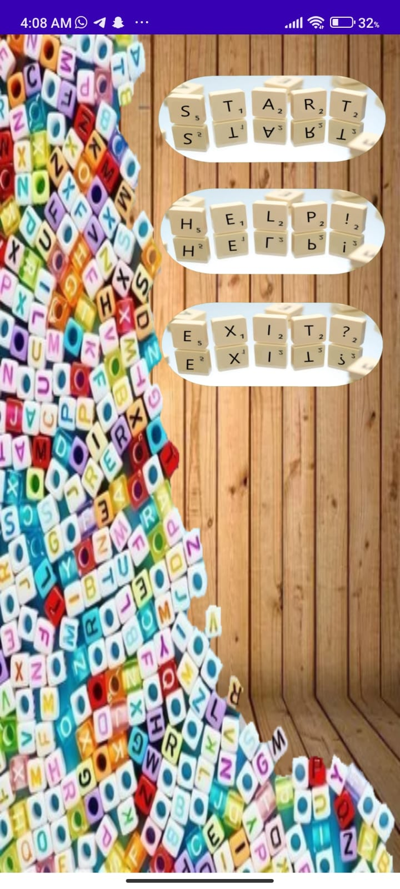
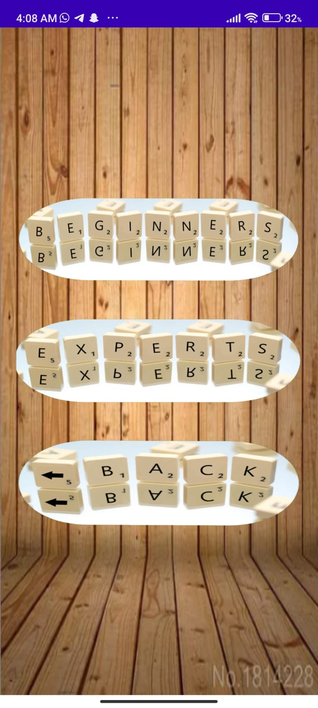
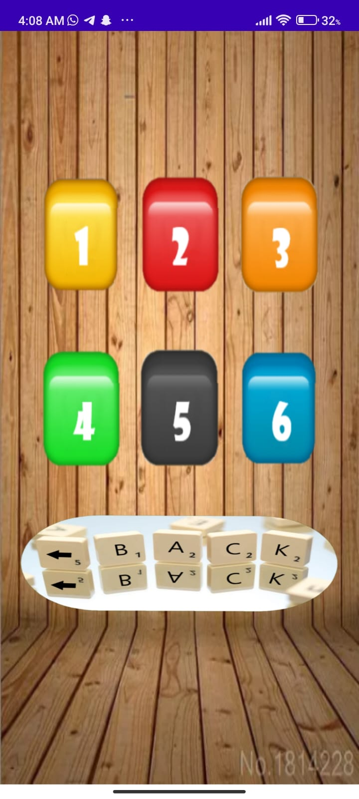
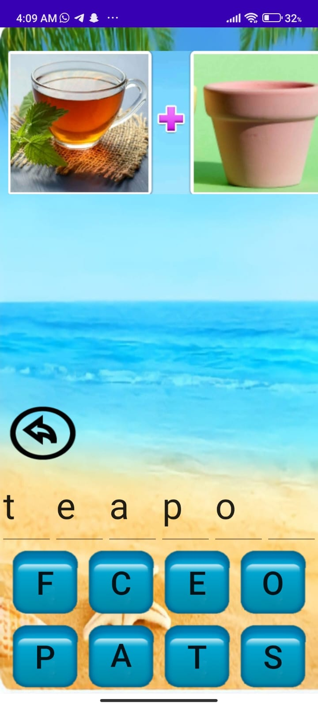
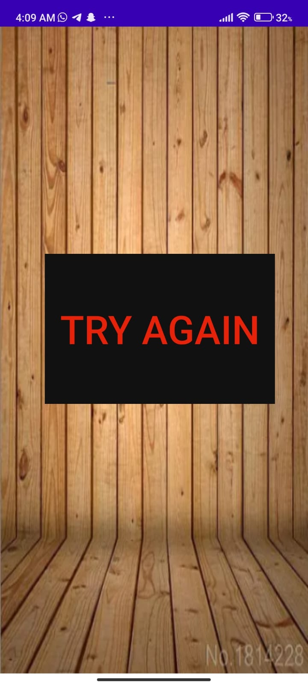

# Word-Game-
A game where the user sees a picture and try to guess it and write its name, the game consists of many levels and two difficulties. the progress of levels is saved in the database.

